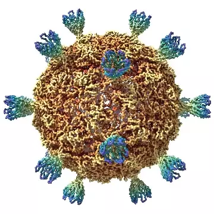
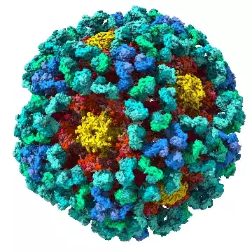
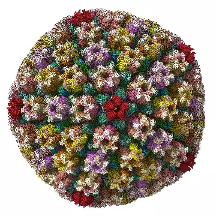
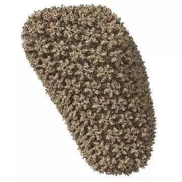

# Hey, welcome to my virus terrarium 🦠

I used [ChimeraX](https://www.rbvi.ucsf.edu/chimerax/download.html) to visualize virus capsid data from the [Protein DataBank (PDB)](https://www.rcsb.org/)

Then, I used [react-three-fiber](https://github.com/pmndrs/react-three-fiber) and [@react-three/cannon](https://github.com/pmndrs/use-cannon) to render and simulate physical interactions.

Molecule mass and size data sourced from PDB.

<a href="https://www.rcsb.org/structure/1KVP">
  

      
<i>Spiroplasma SPV4</i> <small>(497 atoms)</small>

      

  

</a>
<a href="https://www.rcsb.org/structure/3J6R">
  

      
<i>Human Papillomavirus (HPV)</i> <small>(11,466 atoms)</small>

      

  

</a>
<a href="https://www.rcsb.org/structure/6CGV">
  

      
<i>Adenovirus</i> <small>(99,723 atoms)</small>

      

  

</a>
<a href="https://www.rcsb.org/structure/6LGN">
  

      
<i>Chicken Pox (Varicella Zoster)</i> <small>(208,346 atoms)</small>

      

  

</a>
<a href="https://www.rcsb.org/structure/3J3Y">
  

      
<i>HIV</i> <small>(2,116,800 atoms)</small>

      

  

</a>

  <i>Click a virus to see it in the Protein DataBank!</i>

### Other tools:

- [gltfjsx](https://github.com/pmndrs/gltfjsx) - transform .gltf or .glb files into .jsx React components
- [react-three-gui](https://github.com/birkir/react-three-gui) - quick GUI controls for any variable
- [zustand](https://github.com/pmndrs/zustand) - simple global state managemer

### ChimeraX commands:

In ChimeraX, you can type commands in the terminal at the bottom.

`color radial all palette Spectral-1` - colour all atoms radially, with the Spectral-1 [palette](https://www.rbvi.ucsf.edu/chimerax/docs/user/commands/color.html#palette-options)
`surface all resolution 6` = [surface-render](https://www.rbvi.ucsf.edu/chimerax/docs/user/commands/surface.html) each atom with a sphere of radius 6 Angstroms (Å)
`windowsize 640 640` - set viewport to 640 width and height
